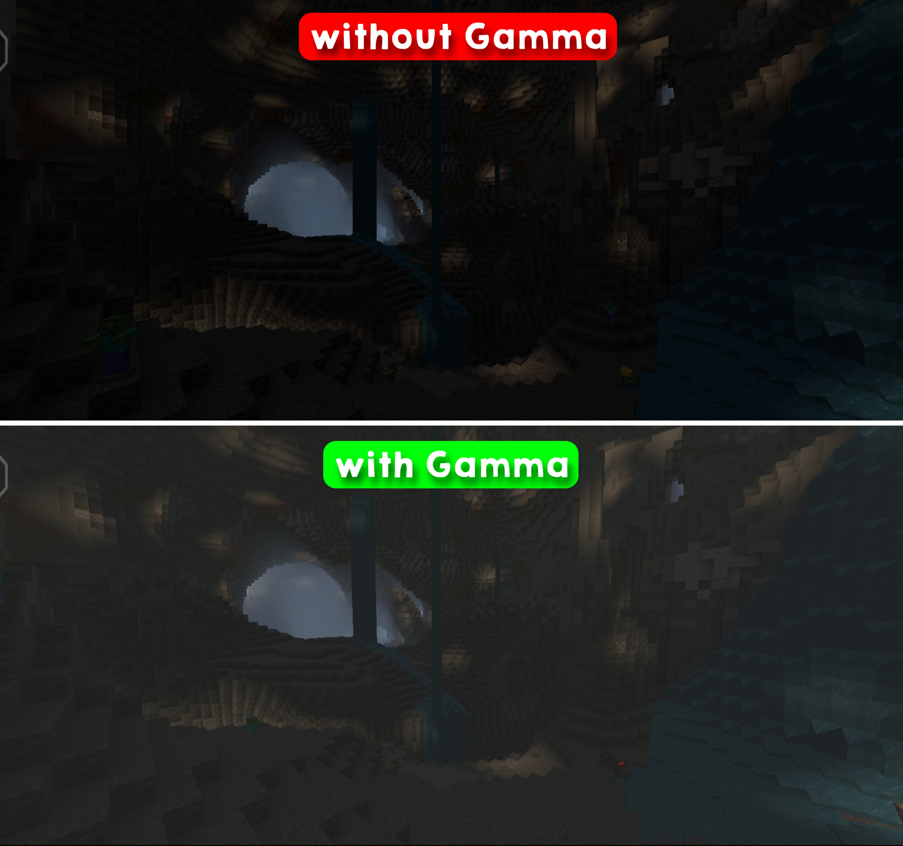

# **D31 NIGHT VISION GAMMA v0.1.5-beta**
> ***Made in Indonesia*** 🇮🇩 
> ***Created by Ryuu Mitsuki***

## **[DOWNLOAD FILES]**
- [Direct link](https://github.com/mitsuki31/d31-nv-gamma/releases/download/v0.1.5-beta/d31-nv-gamma.v0.1.5-beta.mcpack)
- [Mediafire](https://www.mediafire.com/file/j2fausjbrw9xyg8/D31_-_NV_%2528BETA%2529.mcpack/file)

## **⚠️[ATTENTION]⚠️**
> **Warning** ***Only for Minecraft Pocket Edition*** 
> This isn't a night vision shader!! 
This add-on only increasing gamma with texture and GUI editing!!

## **[REQUIREMENTS]**
- **Minecraft Version : _1.18.12+_** 
- **Storage : _100MB+ free_** 
- **RAM : _2GB+ or 500MB free_**

